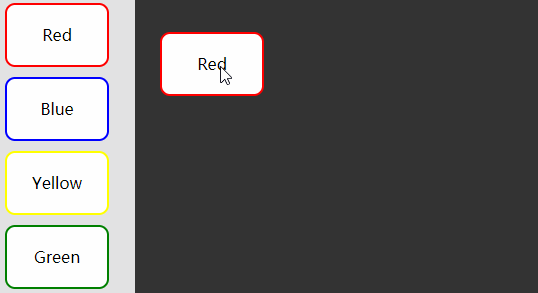

# jsPlumb Demo

基于jsPlumb.js做的练习



# 教程（更新中）
* [jsPlumb学习笔记（1）](http://21ido.com/2018/01/c1587beb/)
* [jsPlumb学习笔记（2）](http://21ido.com/2018/01/d3edd405/)

### 安装

无需安装，双击index.html用浏览器打开即可


也可以执行
```
npm install
```
安装依赖库jQuery和jsPlumb，但是没必要
